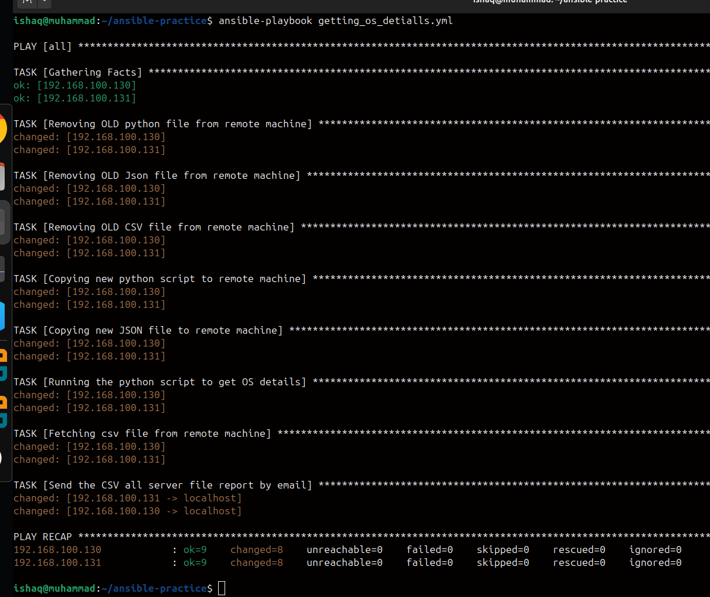
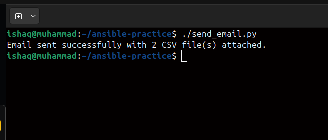
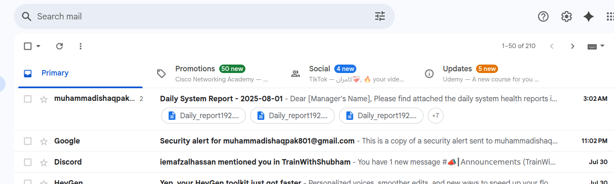
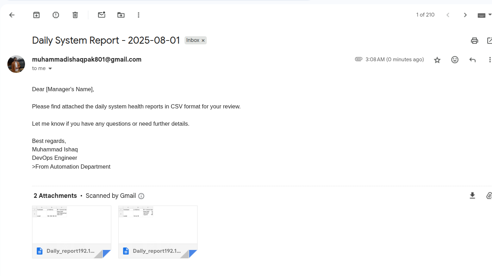

# 🐧 Automated Linux System Report with Ansible & Python

[](LICENSE)
[](https://www.python.org/)
[](https://www.ansible.com/)

This project automates daily Linux system reporting by collecting OS details from remote servers, generating a CSV report, and emailing it automatically to the manager — all powered by Ansible and Python.

---

## 🚀 **Project Overview**

With a single command, this project:
- Connects to remote Linux machines.
- Copies a Python script & JSON configuration.
- Runs the script to gather hostname, IP address, storage info.
- Generates a CSV report on the remote machine.
- Fetches the report back to the local machine.
- Automatically sends it as an email to the manager.

This is a real-world example of **DevOps automation** to save time and ensure accurate daily reporting.

---

## 📦 **Project Structure**

```
ansible_project/
├── csv/                         # Folder where fetched CSV reports are stored locally
│   └── Daily_report*.csv
├── Daily_report.csv             # Example CSV report
├── get_os_details.py            # Python script run on remote machine to collect data
├── getting_os_detialls.yml      # Ansible playbook automating the workflow
├── hosts                        # Ansible inventory file (remote machine IPs / hostnames)
├── my_linux_cmd.json            # JSON file with Linux commands to run
├── Screenshot*.png              # Screenshot(s) showing project in action
└── send_email.py                # Local Python script to email the latest report
```
## 📧 Email Automation
After collecting data and fetching the CSV, the playbook triggers send_email.py on your local machine.
This script:

Dynamically finds the latest CSV in the csv/ folder.

Attaches it to an email.

Sends it to your manager automatically.

## ⚠️ Important: 
Update youremail@example.com and yourpassword in send_email.py with your actual credentials or an App Password.

## 🛠 Tech Stack
✅ Ansible – automation & orchestration

✅ Python 3 – data collection & email

✅ Linux – remote systems (Ubuntu/CentOS)

## 📥 Requirements
✅ On your local machine:

Python 3.6+

Python packages:
```
pip install smtplib ssl email glob
```
Ansible:
```
sudo apt install ansible
```
✅ On remote machines must install:

Python 3 installed

## ⚙️ Setup & Usage
Clone this repository:
```
git clone https://github.com/yourusername/linux-system-report.git
cd linux-system-report
```
Update the hosts file with your remote machine IPs or hostnames.

Edit send_email.py to set your email, password (or app password), and manager’s email.

Run the Ansible playbook:
```
ansible-playbook getting_os_detialls.yml
```
✔️ That’s it! The report is automatically generated, fetched, and sent by email.

## ✏️ About this project
This project shows how Ansible + Python can automate daily operations — like collecting system info and reporting — to reduce manual effort, save time, and ensure accuracy.

A perfect mini DevOps project for learning or for use in production environments.

# 🖼 Screenshots
## Here’s how the daily system report automation looks in action:






## 📄 License
This project is licensed under the MIT License.

## 🤝 Contribute
Pull requests and suggestions are welcome! Feel free to fork and improve the project.
